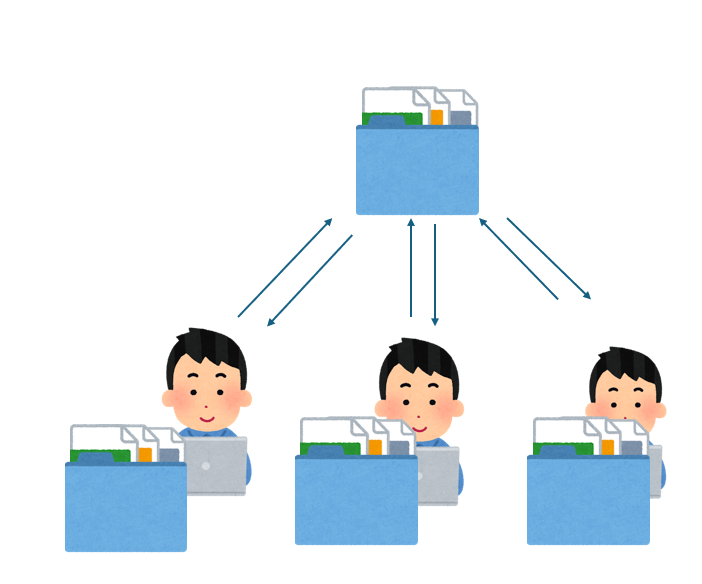
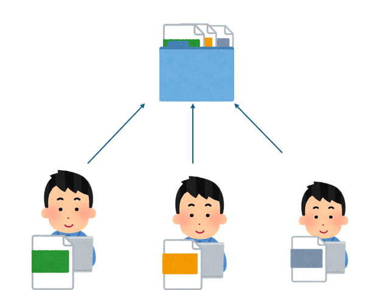

# チーム開発のすすめ

## はじめに
「人と一緒に開発してみたいな」ってなった時どのようにどのような手段を思いつきますか? チャットでファイルを共有したり、共有フォルダで保存したり、色々な方法があると思います。 今挙げた方法だと、同時に編集できなかったり、他の人がどの箇所を修正したのかわからないという問題があります。 そこでバージョン管理ツールが出てきます!!

## バージョン管理ツールとは
バージョン管理ツールとは、ファイルの変更履歴を記録・追跡し、元に戻したり、複数人での共同作業を効率化したりするシステムです。

## 共有フォルダとの違い
共有フォルダでは、オンライン上のファイルを直接変更しますがバージョン管理ツールでは各個人のローカル環境上でファイルの変更を行います。

